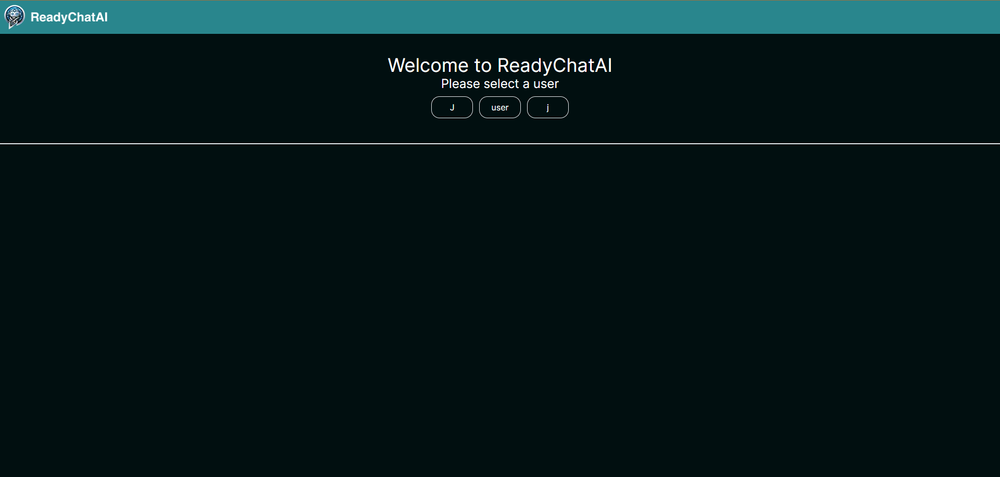
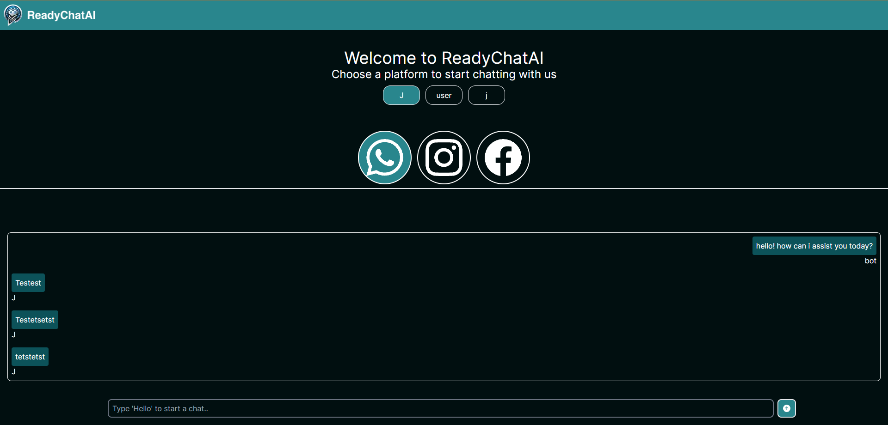
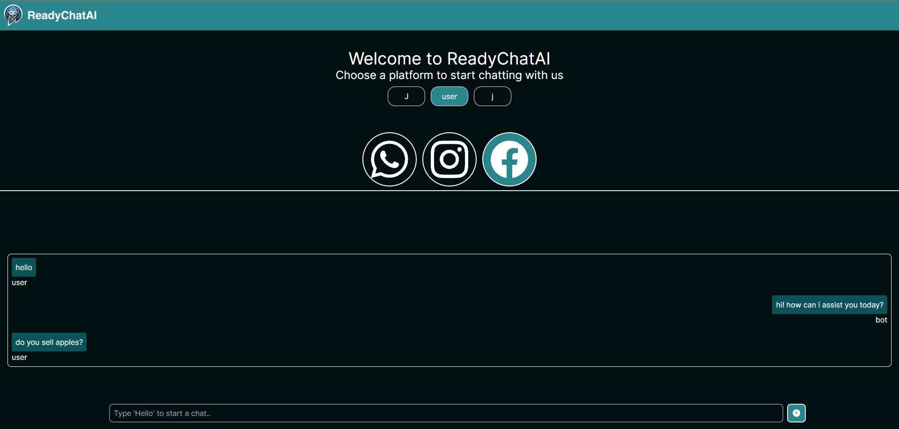

# ReadyChatAI

*FrontEnd intership for ReadyChatAI.*

I developed this project using Next.js to have a fast and efficient web application, combined with Tailwind CSS for styling and React. I created a Single Page Application (SPA) where, upon initiation, users have the option to choose which user's messages they want to display and also on which platform. Previously, users were required to select a user before being able to view the messages. I wasn't able to achieve real-time message popping as each platform was opened, but I did manage to display messages based on each conversation, especially if one of the messages was "Hello".

To accomplish this, I made API calls using fetch, filtering first by user, and then by platform to fetch messages from each user on each platform. Then, using state management, I displayed the messages for that platform.

I designed the application this way because I believe it's the fastest way to render the application and also easy to understand for its usage.

## Screenshots

